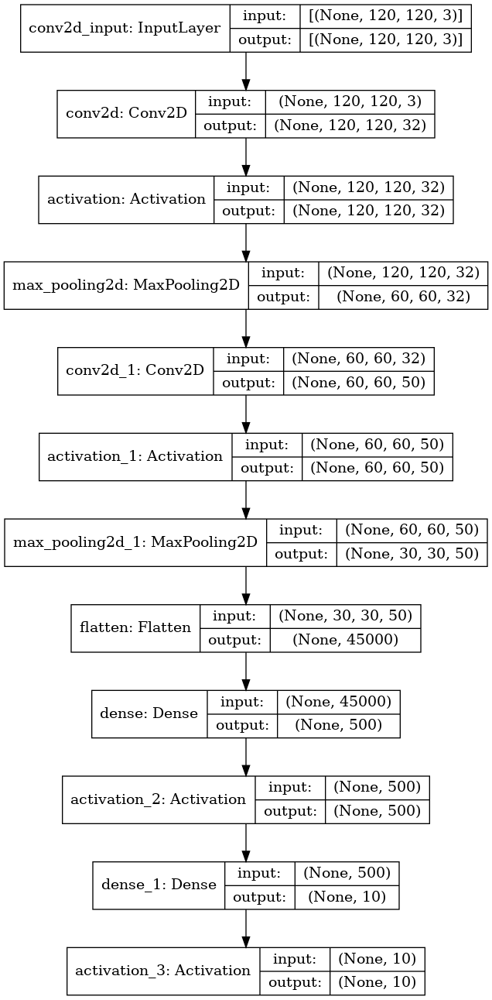

# Assignment 5 - Classification benchmarks
**Christoffer Kramer**  
**10-04-2021**  
Multi-class classification of impressionist painters  
So far in class, we've been working with 'toy' datasets - handwriting, cats, dogs, and so on. However, this course is on the application of computer vision and deep learning to cultural data. This week, your assignment is to use what you've learned so far to build a classifier which can predict artists from paintings.  
You can find the data for the assignment here: https://www.kaggle.com/delayedkarma/impressionist-classifier-data  
Using this data, you should build a deep learning model using convolutional neural networks which classify paintings by their respective artists. Why might we want to do this? Well, consider the scenario where we have found a new, never-before-seen painting which is claimed to be the artist Renoir. An accurate predictive model could be useful here for art historians and archivists!  
For this assignment, you can use the CNN code we looked at in class, such as the ShallowNet architecture or LeNet. You are also welcome to build your own model, if you dare - I recommend against doing this.  
Perhaps the most challenging aspect of this assignment will be to get all of the images into format that can be fed into the CNN model. All of the images are of different shapes and sizes, so the first task will be to resize the images to have them be a uniform (smaller) shape.  
You'll also need to think about how to get the images into an array for the model and how to extract 'labels' from filenames for use in the classification report.

## Method  
This model is based on LeNet architecture and uses a convolutional neural network to classify images. It is supposed to be a “quick-n-dirty” deep learning classifier, which can be easily applied to new data sets with customizable parameters. The only requirement is that the data set is placed in the “data” folder, and is structured correctly.  

## How to run  
This should work on both Linux, Mac, and Windows. However, If you are running on a local windows machine, you should run it from a bash emulator such as git bash.  
Because of limitations regarding data storage on git, I'm uploading a very small slice of the data. So the performance is atrociously bad (around 18%). Moreover, when resizing images you might encounter the following warning "Corrupt JPEG data: 10 extraneous bytes before marker 0xd9". Ignore this, since it just means, that one of the images is corrupted.  

### Running on small data set:  
**Step 1 - Clone repo:**  
- open terminal  
- Navigate to destination for repo  
- type the following command  
```console
git clone https://github.com/Chris-Kramer/cv101_assignment_5.git
```  
**Step 2 - Navigate to folder “cv101_assignment_5”:**    
```console
cd cv101_assignment_5
```  
**Step 3 - Run bash script:**  
- Use the bash script _run_cnn-artists.sh_ to set up environment and run the script:  
```console
bash run_cnn-artists.sh
```  

### Running on the full data set:  
If you wish to run the full data set, you have to download the data set from https://www.kaggle.com/delayedkarma/impressionist-classifier-data and place the training and validation in the “data” folder. You can then use the parameters `--validation_data` and `-- train_data` to specify the training and validation data. See the section on parameters and the section on custom data sets for further information.  

### Running on windows without a bash emulator  
If you're running on a local windows machine, and don't have a bash emulator, you have to set up a virtual environment, activate it, install dependencies (requirements.txt), and then run the python script manually from the src folder.  

## Output
The bash script will print out a performance report to the terminal and save a summary of the model architecture and a graph of the performance in the folder “output”.  
NOTE: If you’re running on a windows machine, the script might not save an image of the architecture, since pydot doesn’t play well with windows.  

## Using custom data
All data must be located in the “data” folder. You can either use data that has already been split between training and test data or use a data set that needs to be split. The script will automatically resize the images, get x and y data, and find label names (based on the folder names). NOTE: The files in the category folders must only be image files. So make sure, that there aren't any txt, readme, or CSV files in the folders.  

### Split  data
If your data is already split it needs to follow the structure below. The names don't matter just the structure.  

- Training_data_dir
    - category_1_dir
        - image_1.jpg
        - image_2.jpeg
        - image_3.png
    - category_2_dir
        - image_1.jpg
        - image_2.jpeg
        - image_3.png
        
- test_data_dir
    - category_1_dir
        - image_1.jpg
        - image_2.jpeg
        - image_3.png
    - category_2_dir
        - image_1.jpg
        - image_2.jpeg
        - image_3.png
        
### Unsplit data
If the data isn't split, it needs to follow the structure below:
- data_dir
    - category_1_dir
        - image_1.jpg
        - image_2.jpeg
        - image_3.png
    - category_2_dir
        - image_1.jpg
        - image_2.jpeg
        - image_3.png
         
You can specify if your data needs to be split or not with the parameters below.  
If you want to try a data set that is unsplit I have added a data set called "shapes" in the data folder. 

## Parameters
I added a lot of parameters so the model can be customized. It has default values for all parameters. If you want to fiddle around with the model I suggest taking a look at the picture  below so you can see how many layers there are and what types of layers there are.   
  

- `--split_data` Use this flag if you need to split the data in training and test data. It takes a folder as input. The folder must be located in the 'data' folder. The train-split divide will be 80/20%. If you use this flag, you cannot use the flags "train_data" and "test_data".  
    - DEFAULT = None  
- `--train_data` The folder with training data. Must be a subfolder in the 'data' folder (Use this if your data is already split).  
    - DEFAULT = small_training   
- `--validation_data` The folder with validation data. Must be a subfolder in the 'data' folder (use this if your data is already split).  
    - DEFAULT = small_validation.  
- `--architecture_out` The filename of the output image containing the model architecture. The image will be located in the "output" folder.  
    - DEFAULT = model_architecture.png  
- `--performance_out` The filename for output plot over performance. It will be located in the folder "output".  
    - DEFAULT = performance.png  
- `--image_size` The dimensions of resized pictures as a list of ints. The first value represents height, the second value represents width.  
    - DEFAULT = 120 120  
- `--kernel_size` The size of the convolutional kernels that are used in the first and second layer conv2d layer (called conv2d and conv2d_1 in the picture above). Values are given as a list of ints (with a length of 2). The first value represents the kernel size in conv2d the second value represents the kernel size in conv2d_1.  
    - DEFAULT = 3 5 (3x3 and 5x5)  
- `--filters` The number of filters in the convolutional layers (there are two). The argument is a list of ints (length of two). The first value is the number of filters in the first conv2d layer (conv2d). The second value is the number of filters in the second conv2d layer (conv2d_1).  
    - DEFAULT = 32 50  
- `--pool_size` The pool size for the two pooling layers (max_pooling2d and max_pooling2d_1). The argument is a list of ints (length of two). The first value represents pool size in the first pooling layer (max_pooling2d), the second value represents pool size in the second pooling layer (max_pooling2d_1).  
    - DEFAULT = 2 2 (2x2 and 2x2)  
- `--strides` The strides in the two pooling layers (max_pooling2d and max_pooling2d_1). The argument is a list of ints (length of two). The first value represents strides in the first pooling layer (max_pooling2d), the second value represents strides in the second pooling layer (max_pooling2d_1).  
   - DEFAULT = 2 2 (2x2 and 2x2)  
- `--padding` The padding type for each convolutional layer. The argument is a list of strings (length of two). The first value is the padding in the first conv2d layer (conv2d). The second value is the padding in the second conv2d layer (conv2d_1). I recommend that you don't change these. You can learn more about TensorFlow's padding types here: https://www.tensorflow.org/api_docs/python/tf/nn/conv2d.  
    - DEFAULT = same same  
- `--activation_layers` The activation function in each activation layer (There are four). Arguments are given as a list of strings. First value represents first activation layer (activation), second value represents second activation layer (activation_1), third value represents the third activation layer (activation_2). The fourth layer represents the output activation layer (activation_3). I recommend not changing these unless you are doing binary classification. You can read more about TensorFlow's activation layers here: https://keras.io/api/layers/activations/  
    - DEFAULT = relu relu relu softmax  
- `--learning_rate` The learning rate for stochastic gradient descent. This is used in the optimizer.  
    - DEFAULT = 0.01  
- `--batch_size` The batch size processing.  
    - DEFAULT = 32
- `--epochs` The number of epochs that should run.  
    - DEFAULT = 20  

Example:  
_With bash script:_  
```console
bash run_cnn-artists.sh --split_data shapes --architecture_out shapes_arch.jpg --performance_out shapes_performance.jpg --image_size 28 28 --kernel_size 3 3 --filters 15 30 --pool_size 3 3 --strides 3 3 --learning_rate 0.001 --batch_size 50 --epochs 21
```  
_Without bash script:_  
```console
python cnn-artists.py --split_data shapes --architecture_out shapes_arch.jpg --performance_out shapes_performance.jpg --image_size 28 28 --kernel_size 3 3 --filters 15 30 --pool_size 3 3 --strides 3 3 --learning_rate 0.001 --batch_size 50 --epochs 21
```  
## Discussion
The model works fine as a “quick-n-dirty” deep learning classifier, which can be applied to different data sets. However, when trained on the full data set it does seem to overfit. It stops learning the validation data after around 5 epochs and only gets better at the training data. The loss function also seems to diverge at around 5 epochs, where the training loss keeps falling, while the validation loss rises (see figure 2, p. 18). After 20 epochs the model have an accuracy of 32 percent. This suggests that the model isn’t generalizable. However, the model might be useful as a quick way to create pre-trained embeddings on specific domains, which can then be used for style transfer.
The model can probably become more generalizable by adding dropout layers, regularization, early stopping, and by using data augmentation to create more data. Moreover, the model might become better by using pre-trained embeddings from a model, which have been trained on paintings. However, this would risk making the model less generalizable across different domains.  
